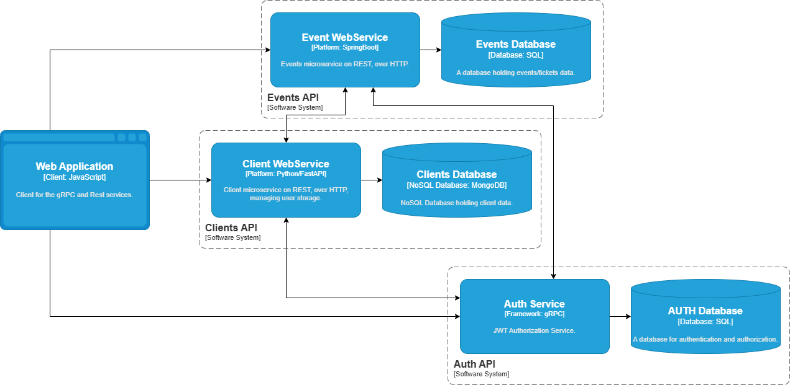

# Client and Event Management System

A microservices-based project for managing clients, events, and ticket sales. This system uses a mix of technologies including Python, Java/Kotlin, and React, with communication handled via REST and gRPC.

## Architecture Overview


### Architecture Diagram


The system consists of the following components:

- **AuthAPI**: A Python FastAPI and gRPC service that handles user registration, authentication, and JWT issuance. It manages user roles (Client, Organizer, Admin) and uses a MySQL database.
- **ClientAPI**: A Python FastAPI service responsible for managing client-specific data. It integrates with the AuthAPI for authentication and communicates with the EventAPI. It uses MongoDB for data persistence.
- **EventAPI**: A Java/Kotlin Spring Boot application that manages events, ticket packages, and individual tickets. It provides a RESTful API and also includes gRPC support. It uses a MariaDB database.
- **Frontend**: A React application built with Vite and TypeScript, providing a user interface for clients, event owners, and administrators.

## Microservices Detail

### 1. AuthAPI (Python)
- **Role**: Identity Provider & Authorization.
- **Tech Stack**: FastAPI, gRPC (`grpcio`), PyJWT, MySQL.
- **Key Features**:
  - gRPC server for internal token validation.
  - JWT-based authentication.
  - User role management.

### 2. ClientAPI (Python)
- **Role**: Client Data Management.
- **Tech Stack**: FastAPI, MongoDB (`motor`), gRPC client.
- **Key Features**:
  - Manages client profiles and ticket history.
  - Validates authentication via AuthAPI gRPC calls.

### 3. EventAPI (Java/Kotlin)
- **Role**: Event and Ticket Lifecycle.
- **Tech Stack**: Spring Boot, Kotlin, MariaDB, JPA/Hibernate, gRPC.
- **Key Features**:
  - RESTful endpoints for event and ticket management.
  - HATEOAS support for API discovery.
  - Integrated gRPC for cross-service communication.

### 4. Frontend (React)
- **Role**: User Interface.
- **Tech Stack**: React 18, Vite, TypeScript, Material UI / Tailwind (as configured).
- **Key Features**:
  - Role-based routing (Protected Routes).
  - State management for authentication.

## Getting Started

### Prerequisites
- Docker & Docker Compose (Recommended)
- Python 3.10+, Java 17+, Node.js 18+ (for local development)
- MySQL, MariaDB, and MongoDB instances

### Running the System with Docker Compose

The easiest way to run the entire system is using the provided `docker-compose.yml`:

```bash
docker-compose up --build
```

This will spin up:
- **Frontend**: [http://localhost:4200](http://localhost:4200)
- **ClientAPI**: [http://localhost:80](http://localhost:80)
- **EventAPI**: [http://localhost:8080](http://localhost:8080)
- **AuthAPI**: [http://localhost:50051](http://localhost:50051) (gRPC)
- **Databases**: MongoDB (27017), MariaDB (3306), MySQL (3307)

### Running the Services Individually (Local Development)

#### AuthAPI
```bash
cd AuthAPI
pip install -r requirements.txt
python server.py
```

#### ClientAPI
```bash
cd ClientAPI
pip install -r requirements.txt
uvicorn main:app --port 80
```

#### EventAPI
```bash
cd EventAPI
mvn spring-boot:run
```

#### Frontend
```bash
cd frontend
npm install
npm run dev
```

## Communication Patterns
- **External**: Frontend communicates with `ClientAPI` (Port 80) and `EventAPI` (Port 8080) via REST.
- **Internal**: `ClientAPI` and `EventAPI` validate tokens by calling `AuthAPI` via **gRPC** on port 50051.
